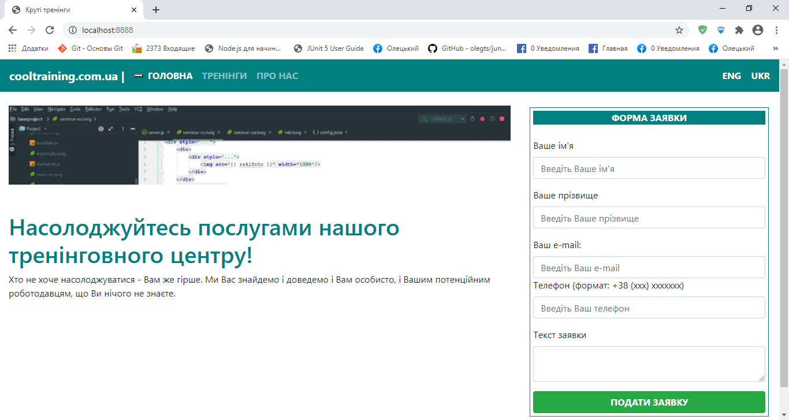
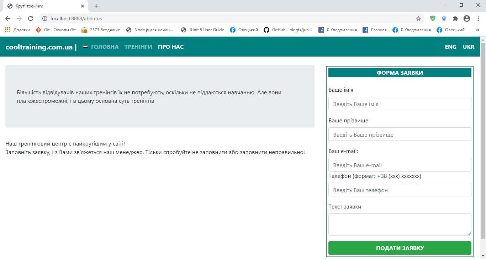
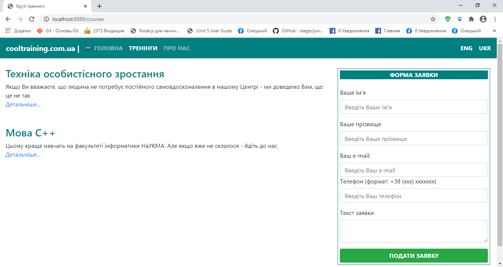

#Крутий сайт

Створити сайт, кожна сторінка якого побудована на основі наступного
макету:

Відображення реалізувати на основі Twitter Bootstrap та одного з
шаблонізаторів. **Повинні бути реалізовані окремі шаблони для меню та
основного контенту, які підключаються до основного шаблону**. Активний
розділ меню повинен бути відповідним чином виділений.

**Пункти меню реалізувати за допомогою циклу в шаблоні**.

На сторінках ГОЛОВНА та ПРО НАС повинна відображатися деяка статична
інформація (ГОЛОВНА була вище, ПРО НАС може мати вигляд, подібний до
такого):

На сторінці ТРЕНІНГИ повинен відображатися перелік тренінгів, які
зберігаються в базі даних - назва та короткий рекламний слоган:

\
При натисканні на лінк (або кнопку) Детальніше... повинен відображатися
більш детальний опис обраного тренінгу.

**Для виведення тренінгів (як в короткій, так і в повній формі)
використати Vue або React (на вибір).** Тренінгові мають відповідати
окремі елементи \<training-short\> та \<training-full\>; передбачити
компоненти для їх обробки. За бажанням обидва компоненти можуть бути
об'єднані в один з відповідними параметрами/атрибутами.

Сайт повинен бути двомовним і підтримувати українську та англійську
версії. Відповідно до цього, мають бути версії сторінок різними мовами.

Реєстраційна форма має надавати можливість користувачеві заповнити
заявку. Якщо поля імені або прізвища не заповнені, повинно виводитися
повідомлення "Поле з прізвищем або іменем не повинні бути пустим". Якщо
електронна пошта є некоректною, має виводитися повідомлення "Введена
пошта є некоректною". Якщо номер телефону не відповідає потрібному
формату, має виводитися повідомлення "Неправильний формат телефону". Для
перевірки формату телефону рекомендується використати регулярні вирази.
Якщо пустий текст заявки, має виводитися повідомлення "Текст заявки не
може бути пустим".

**Контроль правильності заповнення форми та виведення повідомлень
повинні здійснюватися засобами клієнтського JavaScript. Якщо форма
заповнена неправильно, дані на сервер відправлятися не повинні!**

Адміністратор повинен мати можливість встановити режим, який вимагає
стандартного підтвердження електронної пошти на основі листа
користувачеві. Цей режим встановлюється в конфігураційному файлі. В
цьому режимі користувачеві має виводитися відповідне повідомлення. В
разі підтвердження користувачеві надсилається лист про прийняття його
заявки.

Якщо ж режим підтвердження не встановлено, повідомлення про успішне
прийняття заявки має виводитися зразу (при цьому сторінка сайту теж має
відображатися).

Заявки мають зберігатися в базі даних (на вибір - MySQL або MongoDB).

Адміністратору має бути наданий окремий інтерфейс для перегляду та
вилучення заявок, а також для додавання нових тренінгів.

Серверну частину реалізувати на основі Node.js.

Назва сайту (в даному прикладі Круті тренінги), його доменне ім'я (в
даному прикладі cooltraining.com.ua), назва файлу з зображенням для
основної сторінки, колір меню, пункти меню та режим підтвердження мають
читатися з конфігураційного файлу (за замовченням config.json).

За бажанням студента та погодженням з викладачем конкретна предметна
область (тренінги) може бути замінена на іншу (книги, товари тощо), але
зі збереженням усіх інших вимог.
